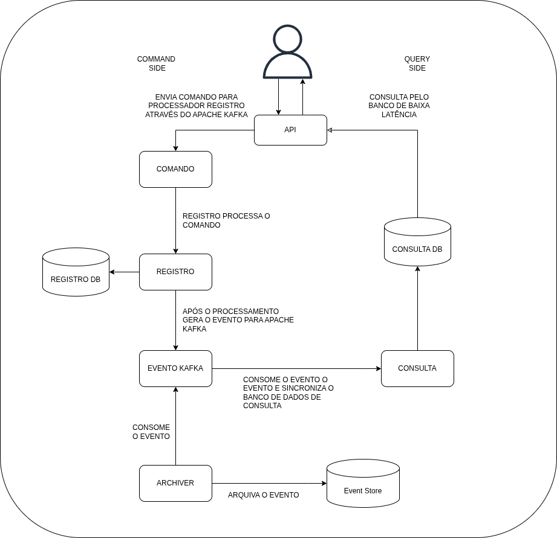

# MyPhotos — Distributed Media Storage Platform
MyPhotos é uma plataforma distribuída auto-hospedada para gerenciamento, armazenamento e processamento de mídias de alta performance e resiliente.
O sistema foi desenhado sob os princípios de *Sistemas Distribuída*, Utilizando uma comunicação assíncrona e orientada a eventos para garantir a alta vazão de escrita e leituras de baixa latência.

---

## Arquitetura do Sistema
O sistema adota o padrão CQRS (Command Query Responsibility Segregation) e Event Sourcing, isolando completamento as operações de escrita (Command Side) das operações de leitura (Query Side) através de schemas de banco distintos (consulta, registro), interconectadas através do Apache Kafka.

### Componentes Chaves
*   **Command Side:** Processador em Go responsável por receber os arquivos via gRPC, fazer a checagem física duplicadas e emitir eventos no sistema.
*   **Archiver:** Processador responsável por interceptar todos os eventos do sistema e realizar no schema `archiver_command`. Isso metiga a retenção de 7 dias dos eventos Kafka e permite a reconstrução do estado de leitura do sistema.
*   **Query Worker (Leitura / Timeline):** Consumidor responsável por sincronizar a tabela balanceada `consulta.registro_media`, otimizada com índices compostos para renderização imediata e paginação eficiente.
*   **Content-Addressable Storage (CAS):** Integração com o storage descentralizado **Garage S3**, onde o nome físico e o caminho do arquivo são definidos estritamente pelo seu hash `SHA-256`.

---

## Soluções Implementadas
### 1. Ingestão e Deduplicação Física (Deduplication)
O upload de mídias pesadas é realizado utilizando **gRPC Streaming**, fracionando o arquivo em *chunks* em tempo real para evitar estouro de memória RAM.
Antes de persistir o arquivo no storage, o sistema valida o hash contra o Garage S3 via `HeadObject`. Se o arquivo já existir fisicamente na rede, o storage é poupado, criando-se apenas um novo ponteiro lógico no banco.

### 2. Deleção Lógica e Garbage Collector Assíncrono
Quando um usuário solicita a exclusão de uma mídia:
1. O Command Side valida a propriedade e emite um evento de `MidiaDeletada`.
2. O Query Side remove o ponteiro lógico instantaneamente, limpando a timeline do usuário.
3. Um mecanismo interno de **Garbage Collector** avalia a quantidade de referências ativas para aquele `hash_sha256` no banco. O arquivo físico e seu respectivo thumbnail só são destruídos do Garage S3 quando o contador de referências lógicas chega a exatamente **zero**.

---

## Tecnologias e Ferramentas

*   **Linguagem Principal:** Go (Golang)
*   **Mensageria & Stream:** Apache Kafka (Kafka Processor API)
*   **Armazenamento de Objetos:** Garage S3 (Object Storage compatível com AWS S3)
*   **Banco de Dados:** PostgreSQL (Segregação de schemas `comando` e `consulta`)
*   **Protocolo de Comunicação:** gRPC / Protocol Buffers, Apache Kafka
*   **Práticas de Engenharia:** Clean Architecture, Domain-Driven Design (DDD).

---

## Como Executar

### Requisitos:
*   **Docker e Docker Compose**
*   **Golang 1.22+ (caso queira rodar fora dos containers e executar script de migração de banco de dados)**

### Migração Da Infraestrutura
*   Em andamento
#### Migração do Postgres
*   Em andamento
#### Migração do Apache Kafka
*   Em andamento
#### Migração do Garage
*   Em andamento
### Executando os Processadores
*   Em andamento
### Testes
*   Em andamento